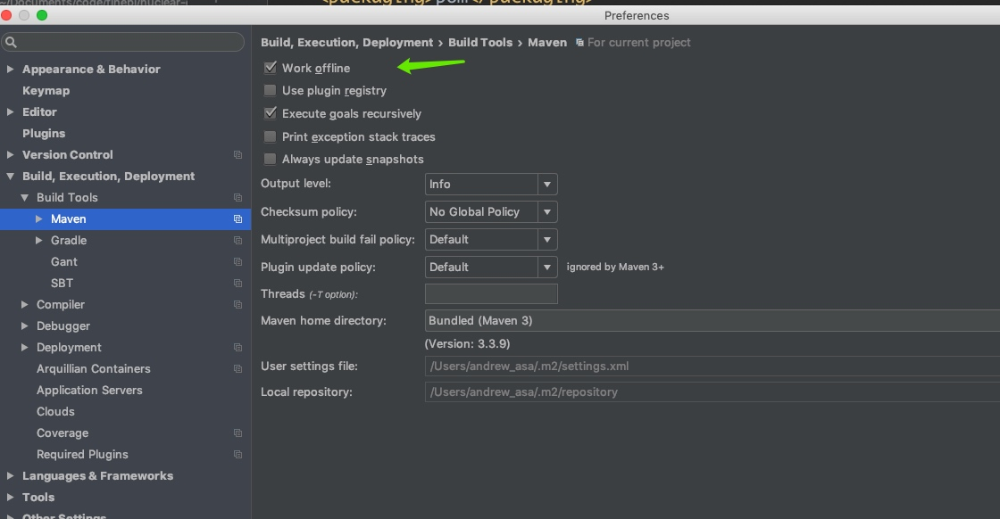

### 零散笔记
+ 国际化文件中文乱码
+ 
+ 控制台中文乱码 
   + 启动vm参数中添加-Dfile.encoding=UTF-8

+ 项目中有多个git项目，源文件不显示记录
  + https://blog.csdn.net/simplemurrina/article/details/73842980
  + setting - version control - add

  
+ 大工程中maven 重复下载jar问题
   + idea 设置maven离线模式
   
  + 在需要的时候手动执行更新，下载相应的jar
  
  ```
  <project xmlns="http://maven.apache.org/POM/4.0.0" xmlns:xsi="http://www.w3.org/2001/XMLSchema-instance"
         xsi:schemaLocation="http://maven.apache.org/POM/4.0.0 http://maven.apache.org/xsd/maven-4.0.0.xsd">
    <modelVersion>4.0.0</modelVersion>
    <groupId>group id</groupId>
    <artifactId>id</artifactId>
    <version>version</version>
    
    <dependencies>
         <dependency>
            <groupId>group </groupId>
            <artifactId>af</artifactId>
            <version>version</version>
        </dependency>
    </dependencies>
</project> 
  ```
   + 手动执行 mvn install 这时候就会自动更新本地maven仓库，然后idea就可以依赖到最新的maven仓库

### 快捷键
+ option+command+u 类继承关系图