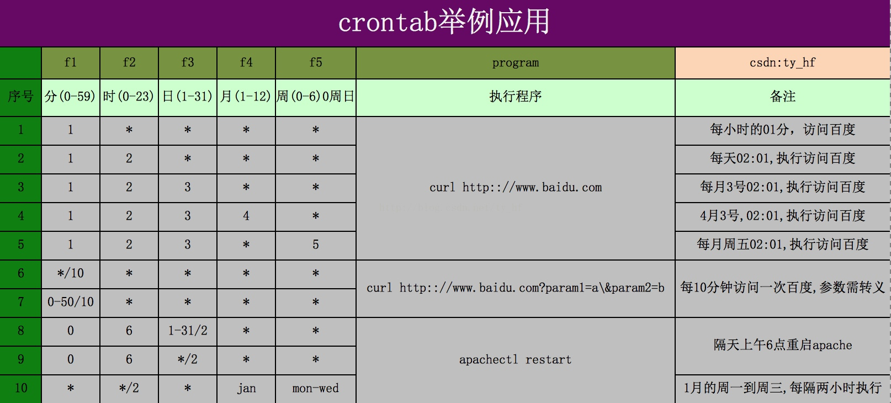

## 定时任务相关
+ crontab
  + 时间设置
  

  + -l 列出定时任务列表
  + -e 添加某项任务

  
## 参考连接
+ [mac下crontab执行定时脚本 https://blog.csdn.net/ty_hf/article/details/72354230](https://blog.csdn.net/ty_hf/article/details/72354230)
+ [crontab 在mac上不执行问题研究 https://segmentfault.com/a/1190000017493725](https://segmentfault.com/a/1190000017493725)
+ [https://blog.csdn.net/qq_23306647/article/details/78993890](https://blog.csdn.net/qq_23306647/article/details/78993890)
  