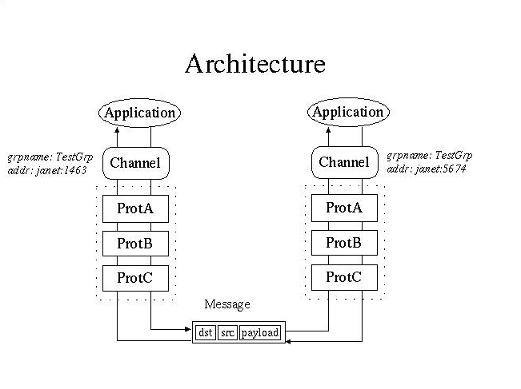

# JGroup 相关协议

+ 事件机制

## MERGE3
+ 1：成员发现，成员更新协议
+ 2：更新的情况有多种
    + 2.1:view 更新
    + 2.2：接收消息的时候发现没有在成员列表里面的ip
    + 2.3：合并子分组
+ 3：探寻子组是否存在

+ down
   + down 下来如果是Event.VIEW_CHANGE事件
   则会检查视图是否一致
   
   
   ## 参考资料
   + [https://developer.jboss.org/wiki/JGroups](https://developer.jboss.org/wiki/JGroups)
      

