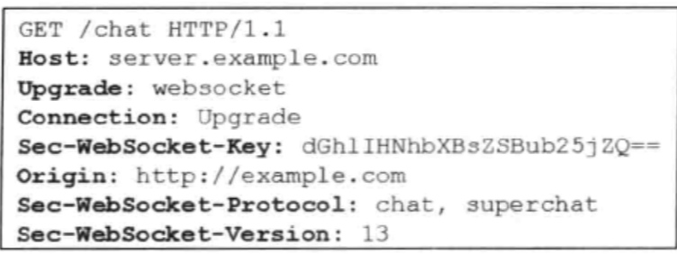
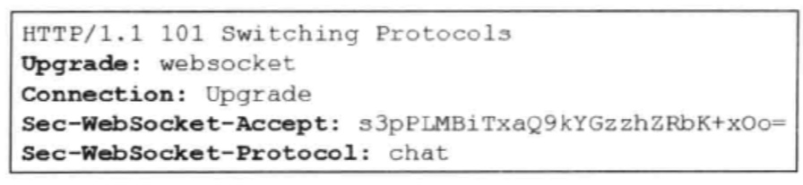

# 目的
1：用netty启动一个websocket服务器端，监听8083端口，收到ws请求的时候进行websocket协议升级，升级之后对websoket客户端传送过来的msg进行回传。
2：用netty启动一个websocket客户端，监听控制台的输入，然后像websocket服务器端发送控制台的输入。

具体项目代码见：
https://cloud.finedevelop.com/projects/RS/repos/ws-proxy/browse

## 服务器端
EchoWebsocketServer
```
package com.asa.lab.ws.lab.server;


import com.asa.log.LoggerFactory;
import io.netty.bootstrap.ServerBootstrap;
import io.netty.channel.Channel;
import io.netty.channel.ChannelInitializer;
import io.netty.channel.ChannelPipeline;
import io.netty.channel.EventLoopGroup;
import io.netty.channel.nio.NioEventLoopGroup;
import io.netty.channel.socket.SocketChannel;
import io.netty.channel.socket.nio.NioServerSocketChannel;
import io.netty.handler.codec.http.HttpObjectAggregator;
import io.netty.handler.codec.http.HttpServerCodec;
import io.netty.handler.stream.ChunkedWriteHandler;

/**
 * @author andrew_asa
 * @date 2019-09-18.
 */
public class EchoWebsocketServer {

    private int port;

    private boolean background;

    public EchoWebsocketServer(int port) {

        this.port = port;
    }

    public boolean isBackground() {

        return background;
    }

    public void setPort(int port) {

        this.port = port;
    }

    public void setBackground(boolean background) {

        this.background = background;
    }

    public void start() {

        if (background) {
            new Thread(new Runnable() {

                @Override
                public void run() {

                    doStart();
                }
            }).start();
        } else {
            doStart();
        }
    }

    public void doStart() {

        EventLoopGroup bossGroup = new NioEventLoopGroup();
        EventLoopGroup workerGroup = new NioEventLoopGroup();
        try {
            ServerBootstrap b = new ServerBootstrap();
            b.group(bossGroup, workerGroup)
                    .channel(NioServerSocketChannel.class)
                    .childHandler(new ChannelInitializer<SocketChannel>() {

                        @Override
                        protected void initChannel(SocketChannel ch)
                                throws Exception {

                            ChannelPipeline pipeline = ch.pipeline();
                            pipeline.addLast("http-codec",
                                             new HttpServerCodec());
                            pipeline.addLast("aggregator",
                                             new HttpObjectAggregator(65536));
                            ch.pipeline().addLast("http-chunked",
                                                  new ChunkedWriteHandler());
                            pipeline.addLast(EchoWebsocketServerHandler.NAME,
                                             new EchoWebsocketServerHandler());
                        }
                    });

            Channel ch = b.bind(port).sync().channel();
            LoggerFactory.getLogger().info("Web socket server started at port " + port
                                                   + '.');
            LoggerFactory.getLogger().info("Open your browser and navigate to http://localhost:"
                                                   + port + '/');

            ch.closeFuture().sync();
        } catch (Exception e) {

        } finally {
            bossGroup.shutdownGracefully();
            workerGroup.shutdownGracefully();
        }
    }

    public static void main(String[] args) throws Exception {

        EchoWebsocketServer server = new EchoWebsocketServer(8083);
        server.setBackground(true);
        server.start();
        LoggerFactory.getLogger().info("start end EchoWebsocketServer");
    }
}

```
具体信息接收处理类EchoWebsocketServerHandler
```
package com.asa.lab.ws.lab.server;

import com.asa.log.LoggerFactory;
import io.netty.buffer.ByteBuf;
import io.netty.buffer.Unpooled;
import io.netty.channel.ChannelFuture;
import io.netty.channel.ChannelFutureListener;
import io.netty.channel.ChannelHandlerContext;
import io.netty.channel.ChannelId;
import io.netty.channel.SimpleChannelInboundHandler;
import io.netty.handler.codec.http.DefaultFullHttpResponse;
import io.netty.handler.codec.http.FullHttpRequest;
import io.netty.handler.codec.http.FullHttpResponse;
import io.netty.handler.codec.http.HttpUtil;
import io.netty.handler.codec.http.websocketx.BinaryWebSocketFrame;
import io.netty.handler.codec.http.websocketx.CloseWebSocketFrame;
import io.netty.handler.codec.http.websocketx.ContinuationWebSocketFrame;
import io.netty.handler.codec.http.websocketx.PingWebSocketFrame;
import io.netty.handler.codec.http.websocketx.PongWebSocketFrame;
import io.netty.handler.codec.http.websocketx.TextWebSocketFrame;
import io.netty.handler.codec.http.websocketx.WebSocketFrame;
import io.netty.handler.codec.http.websocketx.WebSocketServerHandshaker;
import io.netty.handler.codec.http.websocketx.WebSocketServerHandshakerFactory;
import io.netty.util.CharsetUtil;

import java.util.logging.Logger;

import static io.netty.handler.codec.http.HttpVersion.HTTP_1_1;
import static io.netty.handler.codec.rtsp.RtspResponseStatuses.BAD_REQUEST;

/**
 * @author andrew_asa
 * @date 2019-09-18.
 */
public class EchoWebsocketServerHandler extends SimpleChannelInboundHandler<Object> {

    public static String NAME = "EchoWebsocketServerHandler";

    private Logger logger = Logger
            .getLogger(this.getClass().getName());

    private WebSocketServerHandshaker handshaker;

    @Override
    public void channelRead0(ChannelHandlerContext ctx, Object msg)
            throws Exception {

        ChannelId channelId = ctx.channel().id();
        if (channelId != null) {
            LoggerFactory.getLogger().info("channel Read0 channelId: {}", channelId.asLongText());
        }

        // 传统的HTTP接入
        if (msg instanceof FullHttpRequest) {
            handleHttpRequest(ctx, (FullHttpRequest) msg);
        }
        // WebSocket接入
        else if (msg instanceof WebSocketFrame) {
            handleWebSocketFrame(ctx, (WebSocketFrame) msg);
        }
    }

    @Override
    public void channelReadComplete(ChannelHandlerContext ctx) throws Exception {

        ctx.flush();
    }

    private void handleHttpRequest(ChannelHandlerContext ctx,
                                   FullHttpRequest req) throws Exception {

        // 如果HTTP解码失败，返回HHTP异常
        if (!req.decoderResult().isSuccess()
                || (!"websocket".equals(req.headers().get("Upgrade")))) {
            sendHttpResponse(ctx, req, new DefaultFullHttpResponse(HTTP_1_1,
                                                                   BAD_REQUEST));
            LoggerFactory.getLogger().info("http->" + req.uri());
            return;
        }

        LoggerFactory.getLogger().info("websocket->" + req.uri());
        // 构造握手响应返回，本机测试
        WebSocketServerHandshakerFactory wsFactory = new WebSocketServerHandshakerFactory(
                "ws://localhost:8083/" + req.uri(), null, false);
        handshaker = wsFactory.newHandshaker(req);
        if (handshaker == null) {
            WebSocketServerHandshakerFactory
                    .sendUnsupportedVersionResponse(ctx.channel());
        } else {
            handshaker.handshake(ctx.channel(), req);
        }
    }

    private void handleWebSocketFrame(ChannelHandlerContext ctx,
                                      WebSocketFrame frame) {

        if (frame instanceof TextWebSocketFrame) {
            // 返回应答消息
            String request = ((TextWebSocketFrame) frame).text();
            LoggerFactory.getLogger().info("{} receive msg '{}'", ctx.channel(), request);
            ctx.channel().write(
                    new TextWebSocketFrame(request));
        } else if (frame instanceof PongWebSocketFrame) {
            LoggerFactory.getLogger().info("receive PongWebSocketFrame");
        } else if (frame instanceof CloseWebSocketFrame) {
            handshaker.close(ctx.channel(),
                             (CloseWebSocketFrame) frame.retain());
            LoggerFactory.getLogger().info("receive CloseWebSocketFrame");
        } else if (frame instanceof BinaryWebSocketFrame) {
            LoggerFactory.getLogger().info("receive BinaryWebSocketFrame");
        } else if (frame instanceof PingWebSocketFrame) {
            LoggerFactory.getLogger().info("received PingWebSocketFrame");
            ctx.channel().write(
                    new PongWebSocketFrame(frame.content().retain()));
        } else if (frame instanceof ContinuationWebSocketFrame) {
            LoggerFactory.getLogger().info("received ContinuationWebSocketFrame");

        }
    }

    private void sendHttpResponse(ChannelHandlerContext ctx,
                                  FullHttpRequest req, FullHttpResponse res) {

        // 返回应答给客户端
        if (res.getStatus().code() != 200) {
            ByteBuf buf = Unpooled.copiedBuffer(res.getStatus().toString(),
                                                CharsetUtil.UTF_8);
            res.content().writeBytes(buf);
            buf.release();
            HttpUtil.setContentLength(res, res.content().readableBytes());
        }
        // 如果是非Keep-Alive，关闭连接
        ChannelFuture f = ctx.channel().writeAndFlush(res);
        if (!HttpUtil.isKeepAlive(req) || res.status().code() != 200) {
            f.addListener(ChannelFutureListener.CLOSE);
        }
    }

    @Override
    public void exceptionCaught(ChannelHandlerContext ctx, Throwable cause)
            throws Exception {

        cause.printStackTrace();
        ctx.close();
    }
}

```

关键代码解释。
```
WebSocketServerHandshakerFactory wsFactory = new WebSocketServerHandshakerFactory(
                "ws://localhost:8083/" + req.uri(), null, false);
        handshaker = wsFactory.newHandshaker(req);
        if (handshaker == null) {
            WebSocketServerHandshakerFactory
                    .sendUnsupportedVersionResponse(ctx.channel());
        } else {
            handshaker.handshake(ctx.channel(), req);
        }
```
1: 当客户端向服务器端发送的http请求头中带有Upgrade:websocket 请求头。如下图


服务器端接收到这样的get 请求就会知道客户端的http请求想升级为websocket请求。这时候服务器端就会在返回的响应中发送下面的信息

表明同意进行请求协议升级为websocket协议。
而在netty中就是在上面的代码
 handshaker.handshake(ctx.channel(), req);
 中进行处理。所以先可以简单的认为handshaker.handshake之后后面的请求就是
 websocket请求了。而这一切都是netty封装好的，直接拿来用就可以，后面有特别的需要再进行定制。不过这是后话了。

## 客户端
EchoWebsocketClient
```
package com.asa.lab.ws.lab.client;

import io.netty.bootstrap.Bootstrap;
import io.netty.buffer.Unpooled;
import io.netty.channel.Channel;
import io.netty.channel.ChannelInitializer;
import io.netty.channel.ChannelPipeline;
import io.netty.channel.EventLoopGroup;
import io.netty.channel.nio.NioEventLoopGroup;
import io.netty.channel.socket.SocketChannel;
import io.netty.channel.socket.nio.NioSocketChannel;
import io.netty.handler.codec.http.HttpClientCodec;
import io.netty.handler.codec.http.HttpHeaders;
import io.netty.handler.codec.http.HttpObjectAggregator;
import io.netty.handler.codec.http.websocketx.CloseWebSocketFrame;
import io.netty.handler.codec.http.websocketx.PingWebSocketFrame;
import io.netty.handler.codec.http.websocketx.TextWebSocketFrame;
import io.netty.handler.codec.http.websocketx.WebSocketClientHandshakerFactory;
import io.netty.handler.codec.http.websocketx.WebSocketFrame;
import io.netty.handler.codec.http.websocketx.WebSocketVersion;

import java.io.BufferedReader;
import java.io.IOException;
import java.io.InputStreamReader;
import java.net.URI;

/**
 * @author andrew_asa
 * @date 2019-09-18.
 */
public class EchoWebsocketClient {

    private final URI uri;

    private Channel ch;

    private static final EventLoopGroup group = new NioEventLoopGroup();

    public EchoWebsocketClient(final String uri) {

        this.uri = URI.create(uri);
    }

    public void open() throws Exception {

        Bootstrap b = new Bootstrap();
        String protocol = uri.getScheme();
        if (!"ws".equals(protocol)) {
            throw new IllegalArgumentException("Unsupported protocol: " + protocol);
        }

        // Connect with V13 (RFC 6455 aka HyBi-17). You can change it to V08 or V00.
        // If you change it to V00, ping is not supported and remember to change
        // HttpResponseDecoder to WebSocketHttpResponseDecoder in the pipeline.
        final EchoWebsocketClientHandler handler =
                new EchoWebsocketClientHandler(
                        WebSocketClientHandshakerFactory.newHandshaker(
                                uri, WebSocketVersion.V13, null, false, HttpHeaders.EMPTY_HEADERS, 1280000));

        b.group(group)
                .channel(NioSocketChannel.class)
                .handler(new ChannelInitializer<SocketChannel>() {

                    @Override
                    public void initChannel(SocketChannel ch) throws Exception {

                        ChannelPipeline pipeline = ch.pipeline();
                        pipeline.addLast("http-codec", new HttpClientCodec());
                        pipeline.addLast("aggregator", new HttpObjectAggregator(65536));
                        pipeline.addLast("ws-handler", handler);
                    }
                });

        ch = b.connect(uri.getHost(), uri.getPort()).sync().channel();
        handler.handshakeFuture().sync();
    }

    public void close() throws InterruptedException {

        ch.writeAndFlush(new CloseWebSocketFrame());
        ch.closeFuture().sync();
        //group.shutdownGracefully();
    }

    public void eval(final String text) throws IOException {

        ch.writeAndFlush(new TextWebSocketFrame(text));
    }

    public void start() throws Exception {

        BufferedReader console = new BufferedReader(new InputStreamReader(System.in));
        while (true) {
            String msg = console.readLine();
            if (msg == null) {
                break;
            } else if ("bye".equals(msg.toLowerCase())) {
                ch.writeAndFlush(new CloseWebSocketFrame());
                ch.closeFuture().sync();
                break;
            } else if ("ping".equals(msg.toLowerCase())) {
                WebSocketFrame frame = new PingWebSocketFrame(Unpooled.wrappedBuffer(new byte[]{8, 1, 8, 1}));
                ch.writeAndFlush(frame);
                ch.close();
            } else {
                WebSocketFrame frame = new TextWebSocketFrame(msg);
                ch.writeAndFlush(frame);
            }
        }
    }

    public static void main(String[] args) throws Exception {

        EchoWebsocketClient client = new EchoWebsocketClient("ws://localhost:38889/websocket");
        client.open();
        client.start();
    }
}

```
消息接收处理类EchoWebsocketClientHandler

```
package com.asa.lab.ws.lab.client;

import com.asa.log.LoggerFactory;
import io.netty.channel.Channel;
import io.netty.channel.ChannelFuture;
import io.netty.channel.ChannelHandlerContext;
import io.netty.channel.ChannelPromise;
import io.netty.channel.SimpleChannelInboundHandler;
import io.netty.handler.codec.http.FullHttpResponse;
import io.netty.handler.codec.http.websocketx.BinaryWebSocketFrame;
import io.netty.handler.codec.http.websocketx.CloseWebSocketFrame;
import io.netty.handler.codec.http.websocketx.PongWebSocketFrame;
import io.netty.handler.codec.http.websocketx.TextWebSocketFrame;
import io.netty.handler.codec.http.websocketx.WebSocketClientHandshaker;
import io.netty.handler.codec.http.websocketx.WebSocketFrame;
import io.netty.util.CharsetUtil;

/**
 * @author andrew_asa
 * @date 2019-09-18.
 */
public class EchoWebsocketClientHandler extends SimpleChannelInboundHandler<Object> {


    private final WebSocketClientHandshaker handshaker;

    private ChannelPromise handshakeFuture;

    public EchoWebsocketClientHandler(final WebSocketClientHandshaker handshaker) {

        this.handshaker = handshaker;
    }

    public ChannelFuture handshakeFuture() {

        return handshakeFuture;
    }

    @Override
    public void handlerAdded(final ChannelHandlerContext ctx) throws Exception {

        handshakeFuture = ctx.newPromise();
    }

    @Override
    public void channelActive(final ChannelHandlerContext ctx) throws Exception {

        handshaker.handshake(ctx.channel());
    }

    @Override
    public void channelInactive(final ChannelHandlerContext ctx) throws Exception {

        System.out.println("WebSocket Client disconnected!");
    }

    @Override
    protected void channelRead0(ChannelHandlerContext ctx, Object msg) throws Exception {

        final Channel ch = ctx.channel();
        if (!handshaker.isHandshakeComplete()) {
            // web socket client connected
            handshaker.finishHandshake(ch, (FullHttpResponse) msg);
            handshakeFuture.setSuccess();
            return;
        }

        if (msg instanceof FullHttpResponse) {
            final FullHttpResponse response = (FullHttpResponse) msg;
            throw new Exception("Unexpected FullHttpResponse (getStatus=" + response.getStatus() + ", content="
                                        + response.content().toString(CharsetUtil.UTF_8) + ')');
        }

        final WebSocketFrame frame = (WebSocketFrame) msg;
        if (frame instanceof TextWebSocketFrame) {
            final TextWebSocketFrame textFrame = (TextWebSocketFrame) frame;
            LoggerFactory.getLogger().info("Receive msg :  {}", textFrame.text());
        } else if (frame instanceof PongWebSocketFrame) {
            LoggerFactory.getLogger().info("receive pong msg");
        } else if (frame instanceof CloseWebSocketFrame) {
            LoggerFactory.getLogger().info("receive close msg");
            ch.close();
        }
        else if (frame instanceof BinaryWebSocketFrame) {
            LoggerFactory.getLogger().info("receive Binary msg");
            // uncomment to print request
            // logger.info(frame.content().toString());
        }
    }

    @Override
    public void exceptionCaught(final ChannelHandlerContext ctx, final Throwable cause) throws Exception {

        cause.printStackTrace();

        if (!handshakeFuture.isDone()) {
            handshakeFuture.setFailure(cause);
        }

        ctx.close();
    }
}
```

## 运行
1：直接启动websocket服务器端EchoWebsocketServer
2：启动websocket客户端
EchoWebsocketClient
3: 在客户端的控制台进行输入文本。

