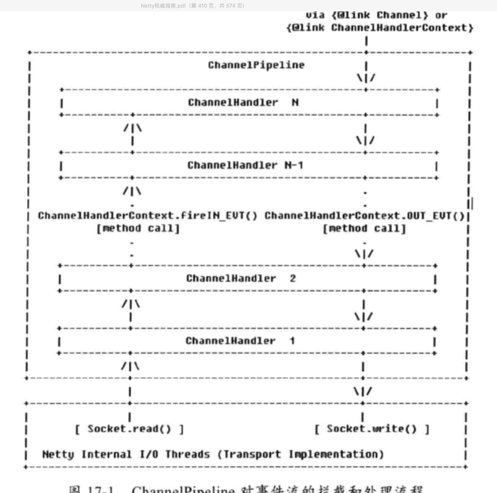

## netty中的websocket 相关

（1） 底层的SocketChannel read() 方法读取ByteBuf，触发ChannelRead事件，由I/O线程NioEventLoop调用ChannelPipeline的fireChannelRead（Object ms），将消息(ByteBuf)传输到ChannelPipeline中。

（2）消息依次被HeadHandler

## 参考链接
[netty中的websocket](https://www.cnblogs.com/duanxz/p/3468974.html)
