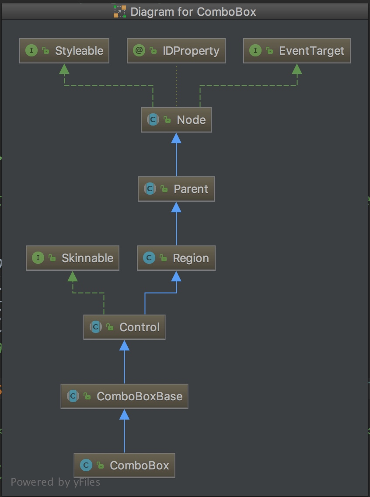

# 零散知识点
+ 类继承图
     

+ addAll时就会用触发事件的方式进行处理，是否可以从这里推论出，我要找到点击下拉进行的选项其实应该到事件里面寻找而不是在comboBox里面寻找。但是如果是这样应该到哪个事件里面寻找呢？
+ 选项面板是一个listview
# Q
+ 点击下拉的时候是怎样进行渲染的？
+ 既然是addAll的时候就会触发事件，那么生成下拉框的时候是否在事件处理类里面就已经生成了下拉面板只是不会显示而已？或者仅仅是点击的时候下拉面板才进行生成？