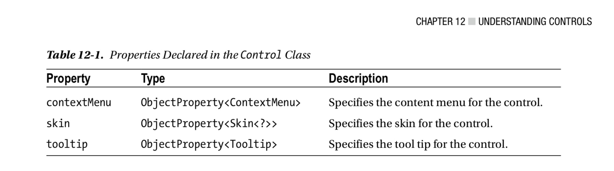
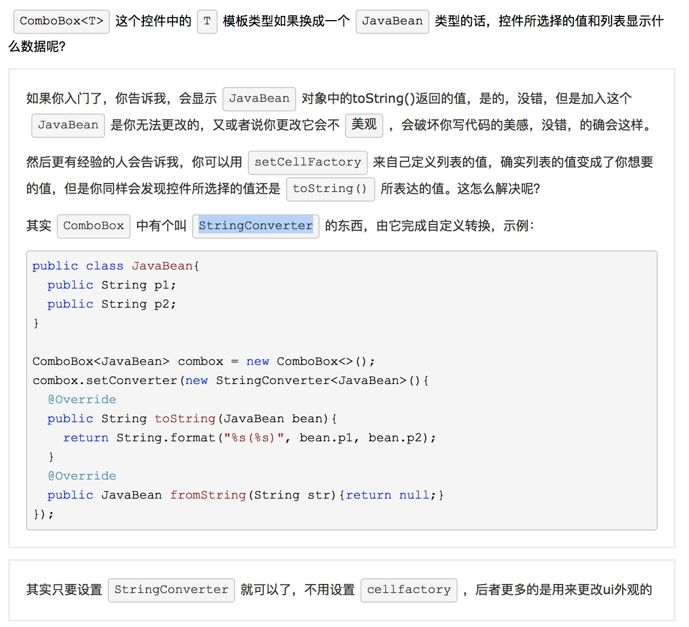

### 控件相关
+ 控件的共性

    + 可以定制上下文菜单
    + 可以定制皮肤
    + 可以显示tooltip
+ Labeled Controls 抽象成为文本显示区域

+ label `可以设置图标，缩放，旋转，文字和图标的相对位置`
+ button `继承自labeled`
    + setEffect 设置效果图
    + setGraphic 设置图片
    
+ ComboBox 下拉框
    + 

### 遗留问题
+ ListView 怎么让其高度和节点数一致？这是布局控制的还是控件自身的属性控制的？

### 参考资料
