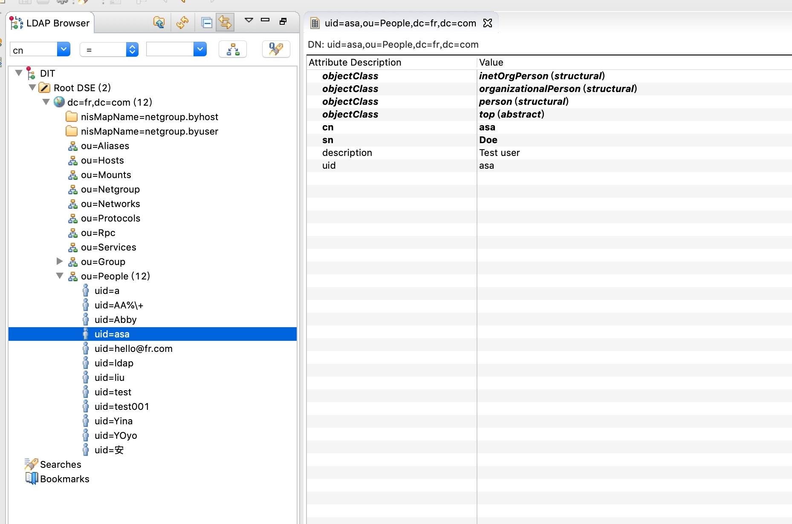

# spring ldap 学习文档

spring ldap的操作基本上是围绕LdapTemplate类进行的。

## 初始化
```
String url = "ldap://192.168.5.250:389";
        String base = "DC=fr,DC=com";
        String userDn = "CN=Users,DC=fr,DC=com";
        String userPwd = "123456";

        LdapContextSource contextSource = new LdapContextSource();
        contextSource.setUrl(url);
        contextSource.setBase(base);
        contextSource.setUserDn(userDn);
        contextSource.setPassword(userPwd);
        contextSource.setPooled(false);
        contextSource.afterPropertiesSet(); // important

        template = new LdapTemplate();
        template.setContextSource(contextSource);
```

## 增删改查操作

假设ldap中的层次结构如上，同时有一个People类
```
@Entry(objectClasses = {"inetOrgPerson", "organizationalPerson", "person", "top"})
public class Person {

    @Id
    private Name dn;

    @Attribute(name = "cn")
    private String cn;

    @Attribute(name = "sn")
    private String lastName;

    @Attribute(name = "description")
    private String description;

    @Attribute(name = "telephoneNumber")
    private String phone;

    @Attribute(name = "uid")
    private String uid;

    public Name getDn() {

        return dn;
    }

    public void setDn(Name dn) {

        this.dn = dn;
    }

    public String getDescription() {

        return description;
    }

    public void setDescription(String description) {

        this.description = description;
    }

    public String getCn() {

        return cn;
    }

    public void setCn(String cn) {

        this.cn = cn;
    }

    public String getLastName() {

        return lastName;
    }

    public void setLastName(String lastName) {

        this.lastName = lastName;
    }

    public String getPhone() {

        return phone;
    }

    public void setPhone(String phone) {

        this.phone = phone;
    }

    public String getUid() {

        return uid;
    }

    public void setUid(String uid) {

        this.uid = uid;
    }
}
```
进行增删改查如下
```
public class PersonDaoImpl implements PersonDao {

    private static final PersonDaoImpl INSTANCE = new PersonDaoImpl();

    private LdapTemplate ldapTemplate = LdapTemplateService.getInstance().getLdapTemplate();

    protected static final Log log = LogFactory.getLog(PersonDaoImpl.class);

    private PersonDaoImpl() {

    }

    public static PersonDaoImpl getInstance() {

        return INSTANCE;
    }

    public void create(Person person) {

        setDn(person);
        ldapTemplate.create(person);
    }

    public void update(Person person) {

        setDn(person);
        ldapTemplate.update(person);
    }

    public void delete(Person person) {

        ldapTemplate.delete(ldapTemplate.findByDn(buildDn(person), Person.class));
    }

    public List<String> getAllPersonNames() {

        return ldapTemplate.search(query()
                                           .attributes("cn")
                                           .where("objectclass").is("person"),
                                   new AttributesMapper<String>() {

                                       public String mapFromAttributes(Attributes attrs) throws NamingException {

                                           return attrs.get("cn").get().toString();
                                       }
                                   });
    }

    public List<Person> findAll() {

        return ldapTemplate.findAll(Person.class);
    }

    private LdapName buildDn(Person person) {

        LdapName ldapName = LdapNameBuilder.newInstance()
                .add("ou", "People")
                .add("uid", person.getUid())
                .build();
        log.info(ldapName);
        return ldapName;
    }

    private void setDn(Person person) {

        person.setDn(buildDn(person));
    }
}
```


## 参考连接
[Spring LDAP官方文档翻译(1-5章)](https://www.jianshu.com/p/77517e26a357)
[Spring LDAP官方文档翻译(6- 章)](https://www.jianshu.com/p/835c2db4a1c4)
[spring-ldap官方文档学习](https://www.cnblogs.com/lyh421/p/6688060.html)
[LDAP 的概念与 Spring LDAP 框架使用](https://blog.csdn.net/antony1776/article/details/80317035)
[LDAP概念和原理介绍](https://www.cnblogs.com/wilburxu/p/9174353.html)
[LDAP入门](https://www.jianshu.com/p/7e4d99f6baaf)
[LDAP 客户端Apache Directory Studio](https://directory.apache.org/studio/)
[spring-ldap学习（二）](https://blog.csdn.net/victor_cindy1/article/details/72575424)